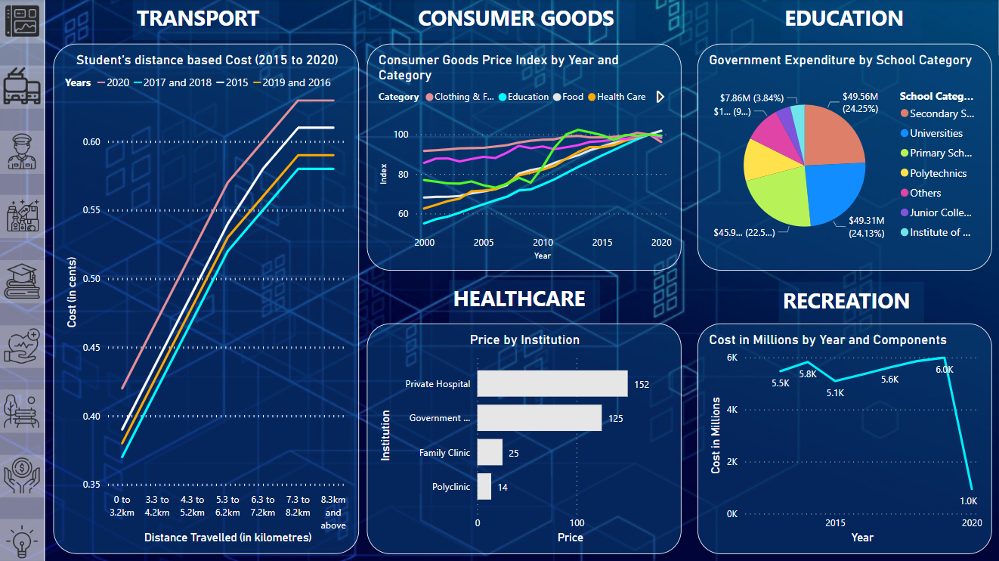
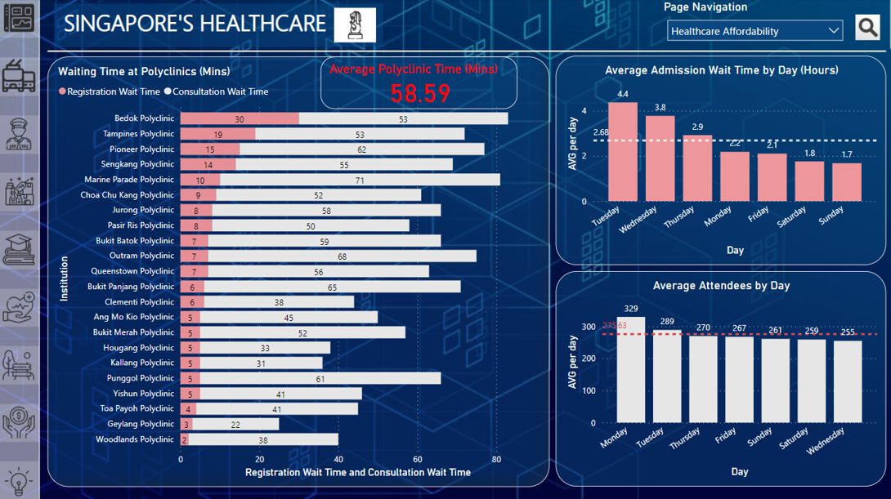
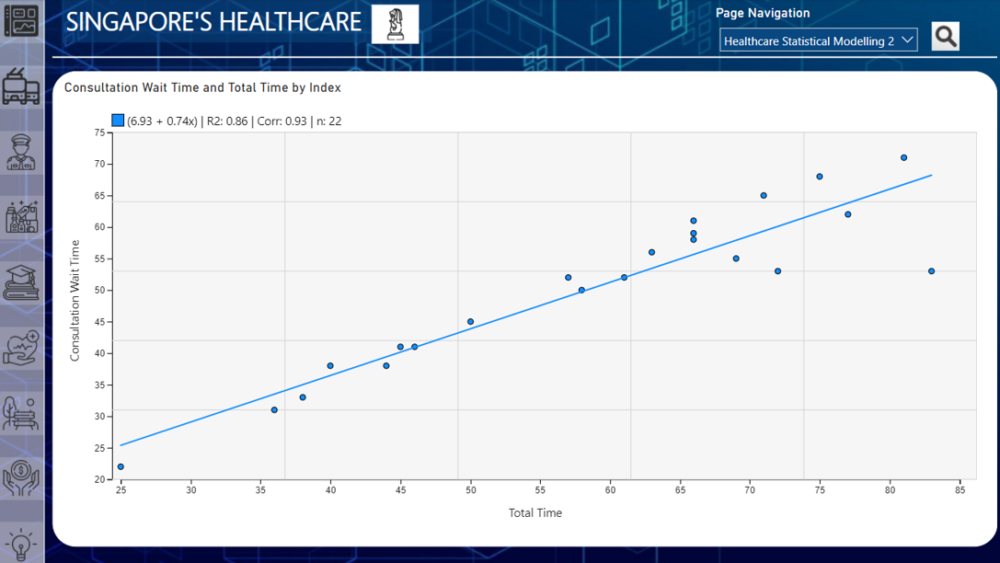
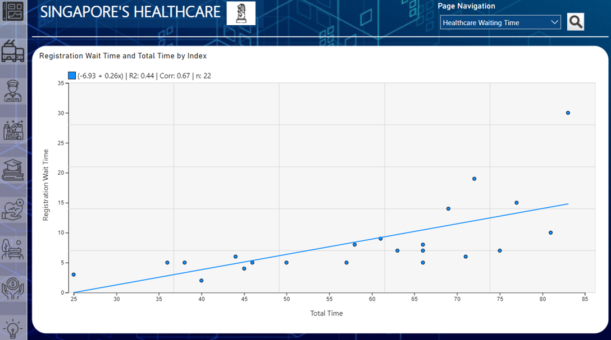
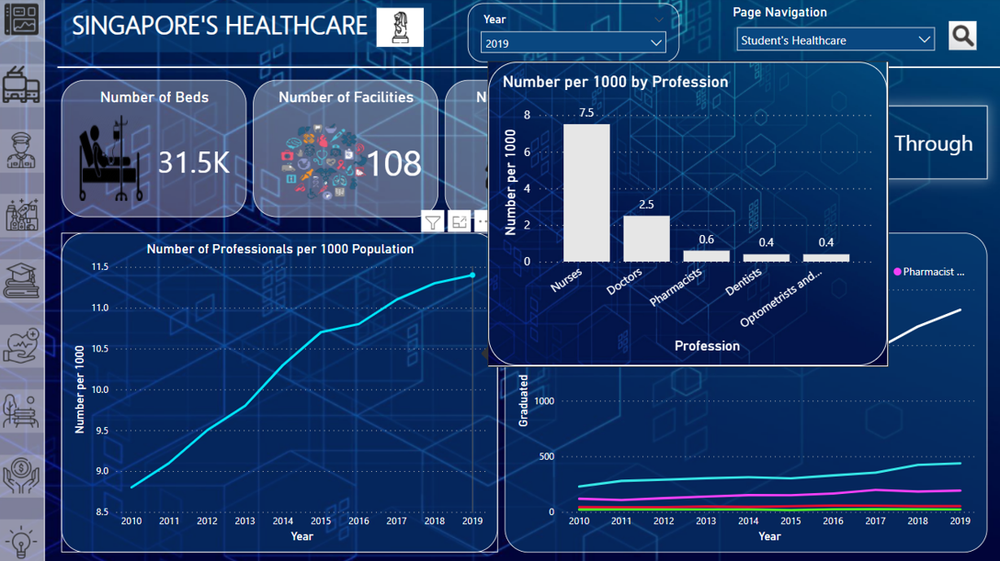
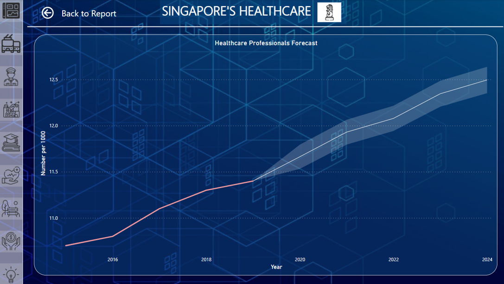
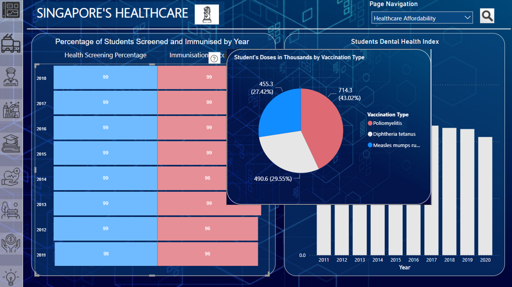
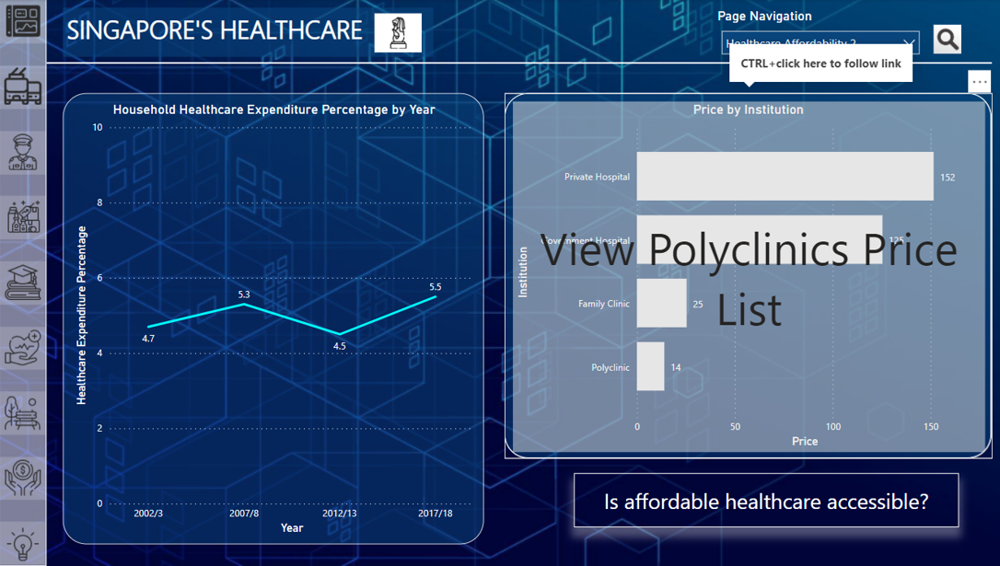
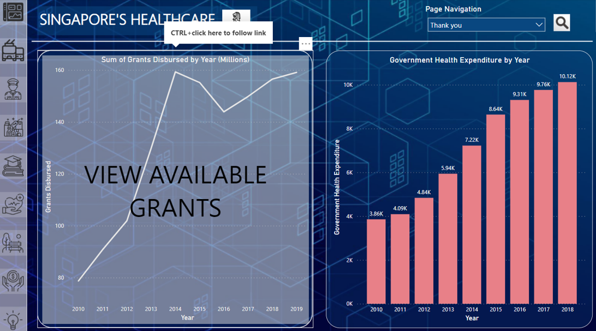
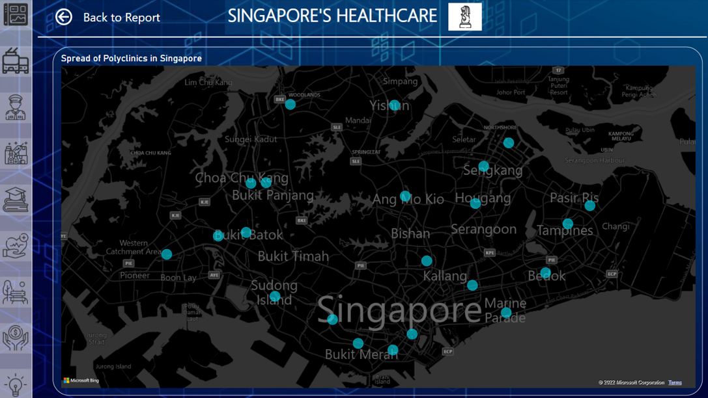

# Power BI Data Analytics
- Hypothesis: Singapore is a good place to live or work in. 
- Analysis on the above hypothesis using Power BI 
- Video Demo of Presentation (no audio): https://vimeo.com/696618821

## Target Users 
Our group decided on a stakeholder group comprised of Singaporean graduates aged 16 to 21, holding either an O Level certificate, Diploma, or both. 

## Purpose
Through this project, we broke down the hypothesis into different factors and unraveled this statement by analyzing its different elements, then united them to produce a complete answer.  
Based on our stakeholder’s interview, we learned that many are unsure of Singapore's suitability as a place to live or work in. While many of them have slight dissatisfaction and unhappiness with their quality of life, they are also satisfied with what they have. Hence, we have created the following visuals in response to our stakeholders' desire for overall affordability of all factors, accessibility to goods and services, subsidies, high-quality services, frequency of services, more and equal opportunities, and smooth transportation.

## Software Used
- Power BI

## Healthcare Reports 
<table>
<tr>
<td></td>
<td></td> 
<td></td>
</tr>
</table>
As our stakeholders expressed a desire for shorter waiting times, the visuals in the figure on the left demonstrate the healthcare waiting times so that stakeholders can better understand the waiting times at hospitals and polyclinics, and how many patients are served by our healthcare professionals daily.
The next 2 figures then illustrate the correlation between consultation and registration waiting times, to the total waiting time. This way, stakeholders can better discern if more time is spent waiting for consultation or registration and plan their time accordingly, with the help of our polyclinic waiting time at the various locations. 
  
<table>
<tr>
<td></td>
<td></td>
</tr></table>
As our stakeholders mentioned that there are insufficient healthcare professionals and facilities, the first image show the facilities, professionals to population ratio, breakdown of professionals, and number of healthcare graduates over the years. 
Then, the next image foresees the number of healthcare professionals over the next 5 years, indicating that the number of healthcare professionals per 1,000 population is estimated to reach 12.5 by 2024, as compared to 11.4 in 2019, hence giving those who feel that the healthcare waiting time is too long, a sense of hope that there will be more professionals on shifts to help speed up the process.  
  

As our stakeholders mentioned that students’ health has been neglected/ overlooked, the above visualizations show the percentage of students who have been screened and immunized, and the dental health index of students. As a result, stakeholders can now determine if students' health is really being neglected as how they previously believed or if what they have mentioned has been disproved. In addition, the hover over feature allows them to view the specific vaccinations provided to them, giving them a better and broader view of whether the medical care provided to them is sufficient.
  
<table>
<tr>
<td></td>
<td></td>
</tr></table>
As stakeholders mentioned that healthcare in Singapore is too expensive, and wanted more affordable healthcare, the visualizations above shows household healthcare expenditure, prices of different healthcare institutions, grants available, and the government's healthcare spending in Singapore. These two pages hence help to aid stakeholders in determining whether healthcare is affordable, which they noted was one of their biggest concerns of living a good quality of life. Additionally, the links provided also helps stakeholders gain a better understanding of affordable healthcare and grants around them, as it leads them to the relevant pages. It also helps stakeholders evaluate if the provisions are adequate to provide them with a good quality of life, after their main concern has been addressed, and the progress and efforts made to improve healthcare quality has been reviewed.
  

The final image uses a map to illustrate the locations of various polyclinics. As shown, polyclinics are readily available at every end of Singapore, proving that Singapore not only provides affordable healthcare but also makes it accessible. 
  

## Conclusion
Overall, based on healthcare, Singapore is a good place to live and work in. Singapore has put much effort to make healthcare accessible, affordable, and of high quality. With the many facilities and accessibility, healthcare in Singapore is definitely more expensive. The government, however, has provided numerous grants to aid in achieving affordability in healthcare. Despite Singapore’s efforts to boost the number of professionals by increasing the number of healthcare graduates every year, the waiting time and the number of professionals could definitely still be improved, to curb the long waiting times patients face. 

Acknowledgement: Thanks Shermaine for writing a comprehensive description of the project and maintaining it!

## Roles 
- <strong>Shermaine</strong>: Healthcare, Design, Merging 
- <strong>Shi Min</strong>: Recreation , Economy
- <strong>Andrew</strong>: Transportation, Security 
- <strong>Zhang Xiang</strong>: Consumer Goods, Education 
